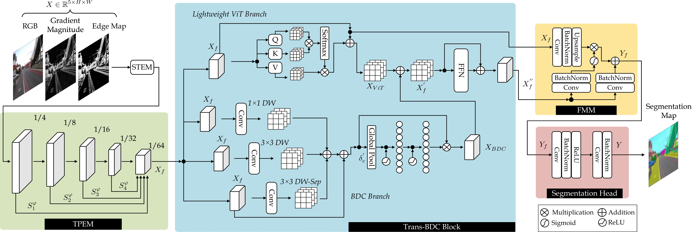
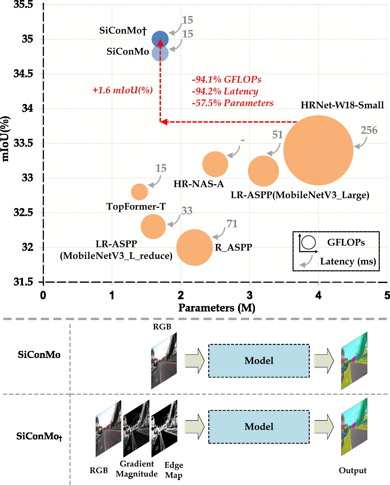
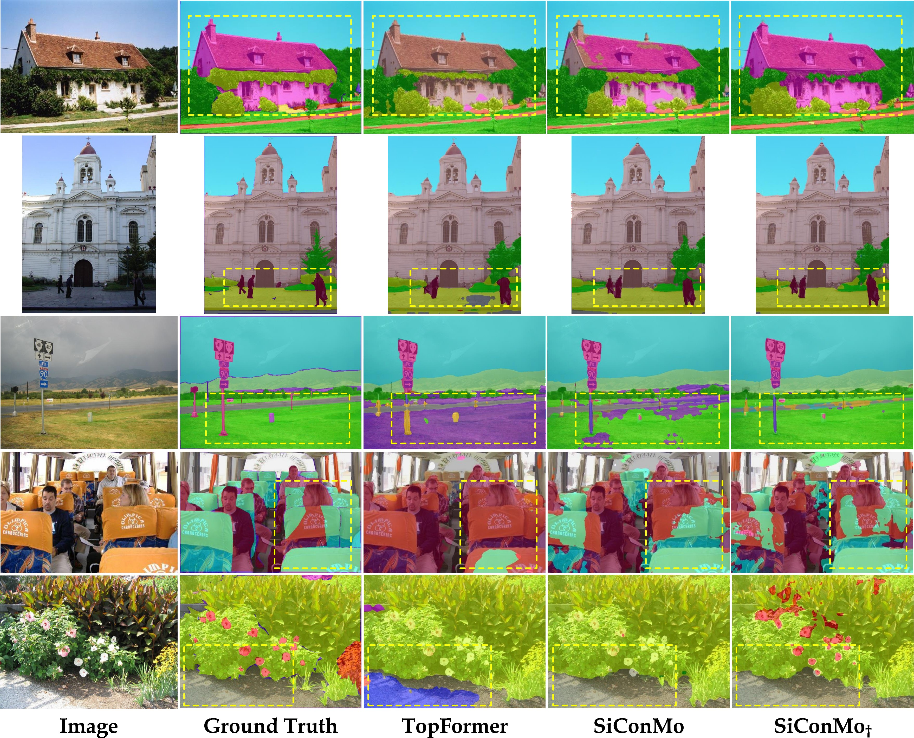
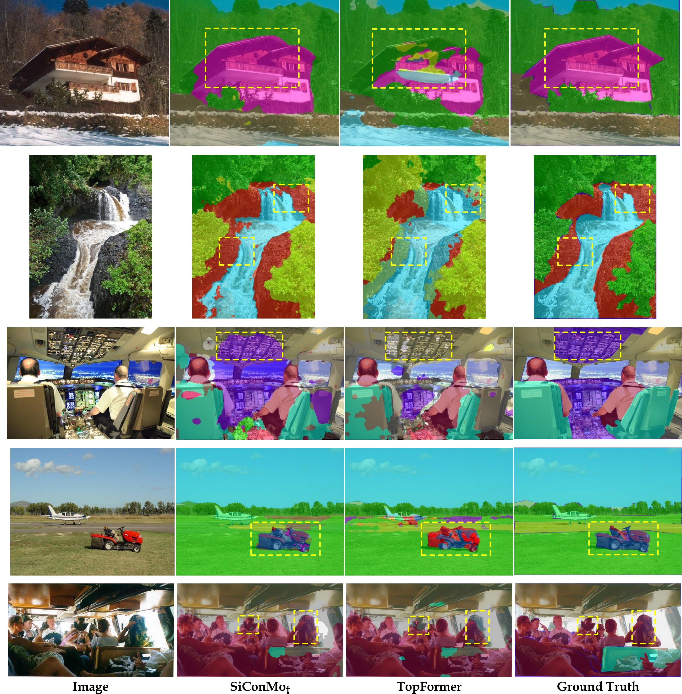

<div align="center">

# When Simplicity Wins: Bottleneck-Aware Context Modeling for Lightweight Semantic Segmentation
🏆 **Top 3% and 🔦 Spotlight Paper Distinction**

**Authors:** Mian Muhammad Naeem Abid, Nancy Mehta, Zongwei Wu, Radu Timofte

**IEEE International Conference on Image Processing (ICIP) 2026**

[](https://ieeexplore.ieee.org/document/11629861)
[](https://arxiv.org/abs/2608.18979)

</div>

## Abstract

> Semantic segmentation demands a careful balance between accuracy, efficiency, and scalability, which remains difficult to achieve for high-resolution imagery. Convolutional networks effectively model local patterns but struggle with long-range dependencies, whereas Vision Transformers capture global context at a high computational cost. While recent work largely focuses on encoder design, the bottleneck stage — central to contextual aggregation and information flow — has been relatively overlooked. We propose SiConMo, a lightweight yet effective framework, implemented in two variants: an RGB-only model (SiConMo) and a GME-enhanced variant (SiConMo†). We show that simplicity arises from a key design principle: at very low computational budgets, the bottleneck is the most efficient stage to integrate local and global context. SiConMo integrates three complementary components: a Token Pyramid Extraction Module for hierarchical multi-scale representation, a Transformer-Branched Depthwise Convolution block for bottleneck-aware context modeling, and a Feature Merging Module that preserves spatial structure while enhancing semantic consistency. Extensive experiments on ADE20K, PASCAL Context, Cityscapes, and COCO-Stuff demonstrate that SiConMo achieves a state-of-the-art accuracy–efficiency trade-off among lightweight semantic segmentation models, highlighting simplicity as a powerful design principle.

---

## Method

<div align="center">

</div>

*Overview of the proposed SiConMo framework. The architecture integrates the Token Pyramid Extraction Module (TPEM) for multi-scale representation, the Trans-BDC block for bottleneck-aware context modeling, and the Feature Merging Module (FMM) for adaptive spatial–semantic integration.*

SiConMo is built around three components:

- **Token Pyramid Extraction Module (TPEM)** — constructs hierarchical multi-scale representations via a sequence of inverted residual (MobileNetV2) blocks, pooling and concatenating feature maps across scales.
- **Trans-BDC Block** — the core bottleneck, combining a Branched Depthwise Convolution (BDC) branch for local pattern modeling with a lightweight ViT branch for long-range dependencies, fused through a depthwise-enhanced feed-forward network.
- **Feature Merging Module (FMM)** — integrates local (TPEM) and global (Trans-BDC) features through a gated fusion mechanism before the segmentation head.

Two variants are proposed: **SiConMo** (RGB-only) and **SiConMo†**, which augments the input with Sobel-based Gradient Magnitude and Edge Maps (GME) for improved structural awareness.

---

## Main Results

<div align="center">

</div>

*Efficiency–accuracy comparison of lightweight semantic segmentation models on the ADE20K validation set. Circle size denotes GFLOPs.*

**ADE20K** (validation set, lightweight models, GFLOPs at 512×512, * denotes the models trained with 448×448 resolution):

| Model | Encoder | mIoU | GFLOPs | Params | Latency (ms) | Resolution | 
|---|---|---|---|---|---|---|
| SiConMo* (Ours) | Ours | 34.4 | 0.5 | 1.7M | 14 | 448×448 |
| SiConMo†* (Ours) | Ours | 34.7 | 0.5 | 1.7M | 14 | 448×448 |
| SiConMo (Ours) | Ours | 34.8 | 0.6 | 1.7M | 15 | 512×512 |
| SiConMo† (Ours) | Ours | 35.0 | 0.6 | 1.7M | 15 | 512×512 |

**PASCAL Context** (test set):

| Model | Encoder | mIoU⁵⁹ | mIoU⁶⁰ | GFLOPs |
|---|---|---|---|---|
| SiConMo (Ours) | Ours | 41.84 | 37.49 | 0.47 |
| SiConMo† (Ours) | Ours | 41.85 | 37.78 | 0.49 |

**Cityscapes** (validation set):

| Model | Encoder | mIoU | GFLOPs |
|---|---|---|---|
| SiConMo (Ours) | Ours | 68.0 | 1.2 |
| SiConMo† (Ours) | Ours | 68.2 | 1.2 |

**COCO-Stuff** (test set):

| Model | Encoder | mIoU | GFLOPs |
|---|---|---|---|
| SiConMo (Ours) | Ours | 29.24 | 0.58 |
| SiConMo† (Ours) | Ours | 29.26 | 0.60 |

**COCO Object Detection** (RetinaNet backbone, val2017):

| Backbone | mAP | GFLOPs | Params |
|---|---|---|---|
| SiConMo† (Ours) | 31.6 | 160 | 10.9M |

Compared with the higher-capacity U-MixFormer (MiT-B0), SiConMo reduces computational cost by 90.2% and parameters by 72.1% at competitive accuracy. Against LR-ASPP (MobileNetV3-Large), SiConMo improves mIoU by 1.9 points with 70.0% fewer GFLOPs, 70.6% lower latency, and 46.9% fewer parameters. (Check paper)

---

## Visual Results

<div align="center">

</div>

*Visual results on the ADE20K validation set. SiConMo produces segmentation maps with improved boundary delineation, finer structural details, and enhanced spatial consistency compared to TopFormer.*

<details>
<summary><b>More Qualitative Results</b> (click to expand)</summary>
<br>
<div align="center">

</div>

*Additional visual results on ADE20K, comparing SiConMo† against TopFormer and ground truth.*
</details>

---

## 📌 Citation

```bibtex
@INPROCEEDINGS{11629861,
  author={Abid, Mian Muhammad Naeem and Mehta, Nancy and Wu, Zongwei and Timofte, Radu},
  booktitle={2026 IEEE International Conference on Image Processing (ICIP)}, 
  title={When Simplicity Wins: Bottleneck-Aware Context Modeling for Lightweight Semantic Segmentation}, 
  year={2026},
  pages={1-6},
  keywords={Modeling;Printing;Semantic segmentation;Design methodology;Timing;Accuracy;Context;Transformers;Convolutional neural networks;Convolution;Lightweight Segmentation;Vision Transformers;Convolutional Neural Networks;Simplicity;Context Modeling;Efficiency},
  doi={10.1109/ICIP61757.2026.11629861}
}
```
